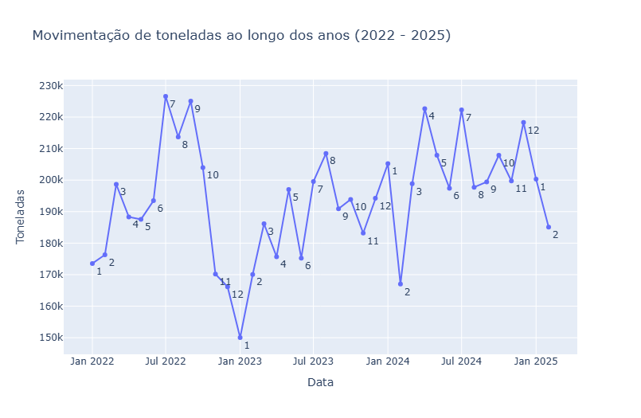
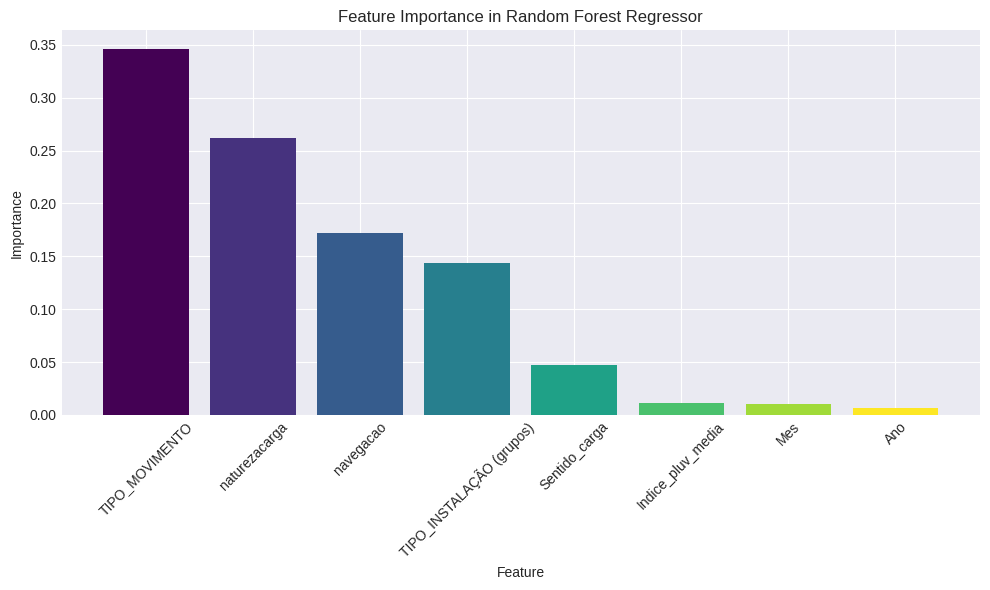
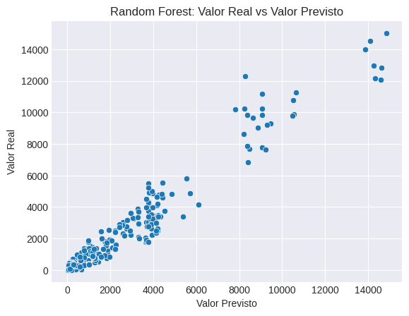

# Análise Preditiva da Movimentação de Cargas no Porto de Santos


**Status do Projeto:** Concluído

## 1. Visão Geral do Projeto
Este projeto de ciência de dados apresenta um estudo completo de ponta a ponta para a previsão da movimentação mensal de cargas (em toneladas) no Porto de Santos, o maior complexo portuário da América Latina. Utilizando um dataset público com registros históricos operacionais e dados climáticos, foram desenvolvidos e comparados múltiplos modelos de machine learning e de séries temporais para identificar a abordagem mais precisa e confiável.

## 2. Acesso ao Projeto Interativo
Este notebook foi desenvolvido com gráficos interativos que permitem uma exploração mais rica dos dados e resultados.

#### **Opção 1: Visualização no Kaggle (Recomendado)**
A melhor experiência de visualização deste projeto, incluindo todos os gráficos interativos e saídas de código, está disponível diretamente no Kaggle. Não é necessário instalar nada, basta acessar o link para explorar a análise completa.

▶️ **[Acessar o Notebook Interativo no Kaggle](https://www.kaggle.com/code/leonardojandrade/porto-santos-v4)**

#### **Opção 2: Execução Local**
Alternativamente, o projeto pode ser clonado e executado em seu ambiente local. As instruções detalhadas estão na seção `8. Como Executar o Projeto` no final deste README.

## 3. Objetivo de Negócio
A capacidade de prever a demanda de movimentação de cargas é crucial para a gestão portuária. Um modelo de previsão acurado permite otimizar a alocação de recursos, melhorar o planejamento estratégico e aumentar a eficiência operacional. O objetivo deste projeto é fornecer uma ferramenta de suporte à decisão que ajude a gestão do Porto a:
* **Antecipar tendências** de alta e baixa demanda.
* **Apoiar o planejamento orçamentário** e de investimentos.
* **Reduzir gargalos logísticos** através de uma melhor previsibilidade.

## 4. Análise Exploratória e Insights
A análise exploratória dos dados revelou padrões importantes sobre a operação do porto.

#### Tendência e Sazonalidade da Movimentação
O volume de toneladas movimentadas exibe uma clara tendência de crescimento ao longo do tempo, além de um forte padrão de sazonalidade anual, com picos de atividade em determinados meses.



#### Fatores Preditivos Mais Importantes
A análise de importância de atributos do melhor modelo (Random Forest) indicou que as características da própria operação são os fatores mais decisivos para a previsão, superando até mesmo a tendência temporal.



## 5. Metodologia
O projeto seguiu um pipeline clássico de ciência de dados:
1.  **Coleta de Dados:** Utilização de dados operacionais do Porto de Santos e extração de dados pluviométricos via web scraping do portal da Prefeitura de Santos.
2.  **Pré-processamento e Engenharia de Atributos:** Limpeza dos dados, tratamento de datas e criação de novas variáveis (features) a partir de componentes temporais e características da operação.
3.  **Modelagem e Comparação:** Treinamento e avaliação de uma gama de modelos, incluindo:
    * **Modelos de Séries Temporais:** ARIMA, SARIMA, SARIMAX, Prophet.
    * **Modelos de Machine Learning:** Regressão Linear, Random Forest, XGBoost.
4.  **Avaliação:** Os modelos foram avaliados usando um conjunto de métricas de regressão (R², MAE, RMSE) e uma métrica de Erro Percentual Relativo à Média.

## 6. Resultados
Os modelos de Machine Learning apresentaram uma performance drasticamente superior aos modelos clássicos de séries temporais.

#### Comparativo de Desempenho
| Modelo          | R²     | MAE (Milhões) | RMSE (Milhões) | Erro Percentual Relativo |
| :-------------- | :----- | :------------ | :------------- | :----------------------- |
| **Random Forest** | **0.93** | **0.91** | **1.60** | **24.10%** |
| XGBoost         | 0.93   | 0.95          | 1.59           | 25.26%                   |
| Prophet         | Negativo | >30.00          | >30.00           | > 100%                   |
| ARIMA           | Negativo | >35.00          | >35.00           | > 100%                   |

**Conclusão Principal:** O modelo **Random Forest** foi o grande destaque, com um erro médio de apenas 24.10% em relação à média histórica, tornando-o uma ferramenta viável para o planejamento estratégico do porto. O modelo final demonstrou alta aderência aos dados reais, como pode ser visto no gráfico abaixo.



## 7. Tecnologias Utilizadas
* **Linguagem:** Python 3
* **Bibliotecas Principais:** Pandas, NumPy, Plotly, Scikit-learn, XGBoost, Statsmodels, Prophet, Matplotlib, Seaborn.
* **Ambiente:** Jupyter Notebook (via Kaggle).

## 8. Como Executar o Projeto
Para executar este notebook em seu ambiente local, siga os passos abaixo:

1.  **Clone o repositório:**
    ```bash
    git clone [https://github.com/LeoJAndrade/porto-santos-analise-preditiva.git](https://github.com/LeoJAndrade/porto-santos-analise-preditiva.git)
    cd porto-santos-analise-preditiva
    ```
2.  **Crie um ambiente virtual (recomendado):**
    ```bash
    python -m venv venv
    source venv/bin/activate  # No Windows: venv\Scripts\activate
    ```
3.  **Instale as dependências:**
    ```bash
    pip install -r requirements.txt
    ```
4.  **Execute o Jupyter Notebook:**
    ```bash
    jupyter notebook "Porto Santos-v4.ipynb"
    ```

## 9. Autor
* **Leonardo J. Andrade**
* **LinkedIn:** [https://www.linkedin.com/in/leonardoandrade/](https://www.linkedin.com/in/leonardoandrade/)
* **Perfil DIO:** [https://web.dio.me/users/leonardobr696?tab=achievements](https://web.dio.me/users/leonardobr696?tab=achievements)
* **Perfil Coursera:** [https://www.coursera.org/user/5d797ab82998e590a20c2307fc31c49b](https://www.coursera.org/user/5d797ab82998e590a20c2307fc31c49b)
* **GitHub:** [https://github.com/LeoJAndrade](https://github.com/LeoJAndrade)
